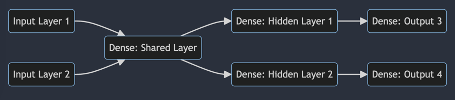

# Keras
`tf.keras` offers a higher level method to compile and execute Models.

It offers Three Programming Models:
1) Sequential

   - The simplest way to create Neural Networks with Linear Topologies.
   
   - You can stack layers to build Networks Works.
   
   - Works for most use-cases.

      


2) Functional 

   - Useful when you want to build a model with more complex (non-linear) topologies.
   
   - We can have multiple inputs and outputs, residual connections with non-sequential flows, and shared and reusable layers.
   
      


3) Model Subclassing

   - Gives highest flexibility, Is used when needed to define Custom Layers.
   
   - You can stack layers to build Networks Works.
   
   - There is a tradeoff in complexity.
      
   - ```python
      # Examples for using Subclassing API
      import tensorflow as tf
      from tensorflow import keras
      from keras.layers import Dense
     
      class MyModel(tf.keras.Model):
          def __init__(self):
              super(MyModel, self).__init__()

          def build(self, input_shape):
              self.dense1 = Dense(64, activation='relu')
              self.dense2 = Dense(64, activation='relu')
              self.dense3 = Dense(10, activation='softmax')
         
          def call(self, inputs):
              x = self.dense1(inputs)
              x = self.dense2(x)
              return self.dense3(x)
     ```